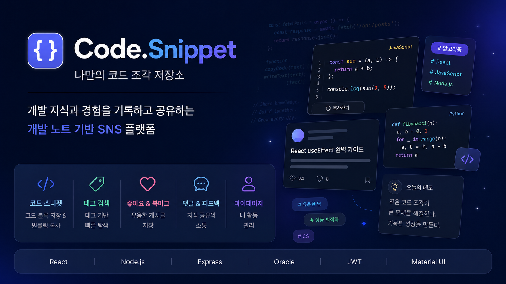

  

 

## 📚 목차
1. [프로젝트 소개](#-프로젝트-소개)
2. [개발 기간](#-개발-기간)
3. [사용 기술](#-사용-기술)
4. [주요 기능](#-주요-기능)
5. [발표 PPT](#-발표-ppt)
6. [시연 영상](#-시연-영상)
7. [프로젝트 자료 모음](#-프로젝트-자료-모음)

---

## 🔎 프로젝트 소개
"나만의 코드 조각 저장소 Code.Snippet"

Code.Snippet은 개발자가 작성한 코드, 트러블슈팅 경험, 학습 내용을 기록하고 공유할 수 있는 개발 노트 기반 SNS 플랫폼입니다.

재사용 가능한 코드 스니펫(Code Snippet)을 중심으로 개발 지식을 축적하고, 다른 개발자와 정보를 공유하며 함께 성장하는 것을 목표로 합니다.

---

## 🗓 개발 기간
| 📅 개발 기간 | 🚦 프로젝트 상태 | 👤 참여 인원 |
|------------|----------------|------------|
| 2026.05.28 ~ 2026.06.08 (개발 기간 종료) |  기본 기능 완료 / 보완 중 | **개인 프로젝트** (1인 개발) |

### 🛠️ 미완성 & 보완 예정 사항

- 🟩 핵심 메인 기능 및 데이터베이스 구축 완료
- ⬛ 미흡한 UI/UX 디자인 디테일 수정 및 반응형 레이아웃 보완
- ⬛ 예외 처리(에러 핸들링) 추가 및 코드 리팩토링
- ⬛ 상용 서버 배포 및 성능 최적화

---

## 🖥 사용 기술

### 🎨 Frontend
| 기술 스택 (Tech Stack) | 사용 목적 및 상세 내용 |
|-----------------------|------------------------|
|   | 컴포넌트 기반 UI 개발 및 React Router를 통한 웹 페이지 라우팅 및 동적 파라미터 처리 |
|   | Material-UI 머티리얼 디자인 적용 및 JavaScript 내장 **Fetch API** 기반 비동기 데이터 통신 |

### 🛠 Backend
| 기술 스택 (Tech Stack) | 사용 목적 및 상세 내용 |
|-----------------------|------------------------|
|   | Node.js 기반 가벼운 MVC 아키텍처 및 RESTful API 서버 설계 |
|   | 비밀번호 단방향 암호화 해싱(Salt) 처리 및 JWT 기반 사용자 토큰 인증 보안 |
|   | 파일/이미지 업로드 멀티파트 데이터 처리 및 크로스 도메인(CORS) 제한 해제 |
|  | REST API 독립적 기능 테스트 및 엔드포인트 HTTP 요청 검증 |

### 🗄 Database & Tools
| 기술 스택 (Tech Stack) | 사용 목적 및 상세 내용 |
|-----------------------|------------------------|
|  | 대용량 데이터 트랜잭션 관리 및 관계형 데이터베이스(RDBMS) 설계 |
|  | 전체 소스코드 편집 및 로컬 확장 프로그램을 활용한 개발 환경 구축 |
|   | Git 기반 소스코드 버전 관리 및 GitHub 원격 저장소를 활용한 백업 |
|  | 화면 와이어프레임 설계 및 UI/UX 프로토타이핑 구현 |

---

## 🧠 주요 기능

### 🔐 회원 인증
- JWT 기반 회원가입 및 로그인
- Access Token 기반 사용자 인증 및 권한 관리
- 로그인 상태 유지

### 📝 게시글 관리
- 개발 노트 및 코드 스니펫 작성
- 게시글 조회, 수정, 삭제 (CRUD)
- 코드 설명 및 코드 블록 등록
- 조회수 집계 기능

### 💻 코드 스니펫
- 가독성을 고려한 코드 블록 제공
- 클립보드 API 기반 원클릭 코드 복사 기능
- 개발 과정의 트러블슈팅 및 학습 내용 기록

### 🏷️ 태그 시스템
- 태그 등록 및 수정
- 태그 기반 게시글 검색

### ❤️ 소셜 기능
- 게시글 좋아요
- 게시글 북마크
- 댓글 작성 및 삭제
- 개발 지식 공유 및 피드백 제공

### 👤 마이페이지
- 내가 작성한 게시글 조회
- 북마크한 게시글 조회
- 프로필 이미지 및 자기소개 관리

### 🔍 검색 기능
- 게시글 검색
- 태그 검색

### 📱 사용자 경험(UX)
- 반응형 웹 지원
- 직관적인 피드 및 상세 페이지 구성
- 코드 복사 기능을 통한 사용성 향상

---

## 📝 발표 PPT
▶ [발표 PPT](https://docs.google.com/presentation/d/1mPHFfHjMCL-igDDXm8NOh7iKPWvJw_Tu/edit?usp=sharing&ouid=109234818455404358768&rtpof=true&sd=true)
---

## 🎥 시연 영상
▶ [시연 영상](https://drive.google.com/file/d/1KNLqPWu7j6MjYGaXeCX7wBc0tcz6RXfv/view?usp=sharing)
---

## 📂 프로젝트 자료 모음
- ▶ [작업 로그](https://docs.google.com/document/d/1Px0daDbBzbfVNXaAyl0Qw5DE-xY_W8dCP4ZKTf7rcsU/edit?usp=sharing)
- ▶ [테이블 설계 및 변경내역](https://docs.google.com/spreadsheets/d/1EpQMGrH7iF6DilJhEz1KWTr2glK1PnkOaKNCY2rWic4/edit?usp=sharing)
- ▶ [ERD](https://drive.google.com/file/d/1hZNISXeGiMejDDadjC6iT5L7Yj3RgSkm/view?usp=sharing)
- ▶ [화면설계](https://docs.google.com/document/d/1Js9LhD6Fnw_6wMBj5jzCLVlZvEThQ5UV5VN6rjayNnU/edit?usp=sharing)
- ▶ [오류 노트](https://docs.google.com/spreadsheets/d/10L6R3Qvdq-DuoqFx2fpj7pBrJ-SwYoeMhG87t23zkDU/edit?usp=sharing)

---
